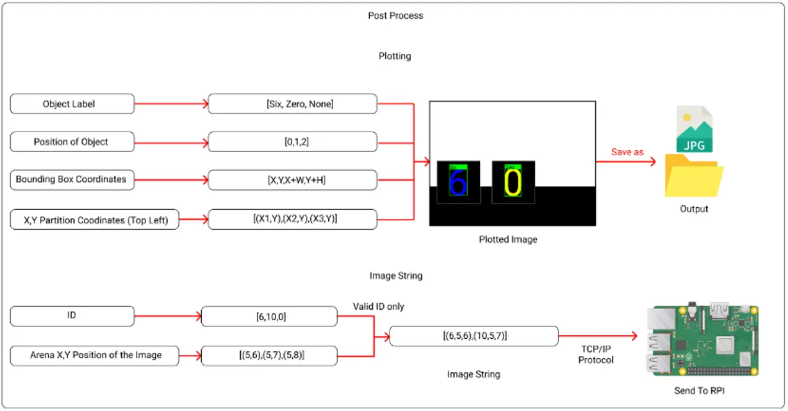

# Deteson

It is one of the [NTU](https://www.ntu.edu.sg/)'s CZ3004 Multi-Disciplinary Design Project Module.

## What?

Our team of 10 students are participating in robotic challenges to fulfilled the given objectives. One such objectives was object detection correctness within the duration of the challenge. Our team are then split into each division base on separation of concerns.

Our division (RPI - Image Recognition) are tasks to develop an object detection model, it should be able to detect the given sets of alphanumeric cards correctly using capture images from the camera mounted from the moving robot, and be able to send the outputs on the monitor screen remotely.

## Why?

To apply knowledge learnt on pre-requisite modules and dive in-depth onto one or two disciplines, and experience working in multi-discipline cooperation environment.

## How?

1. Research on possible application for this use case
2. Defined the possible flows
3. Proof of Concept (POC) of the chosen flow
4. Defined all required functions, terms, facts and rules
5. Construct data templates and insert data knowledge
6. Compile and Execute the binary file
7. Run and test the expected outcomes
8. Improve the process and update accordingly

## Highlights

## Disclaimer

All external data and assets in this project used is intended for educational purpose only.

## Contributor

Deteson (RPI - Image Recognition) Division

MDP G22 Team
